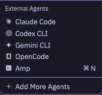

# ACP adapter for AmpCode



Use [Amp](https://ampcode.com) from [ACP](https://agentclientprotocol.com/)-compatible clients such as [Zed](https://zed.dev).

## Prerequisites

- [Amp CLI](https://ampcode.com) installed and authenticated (`amp login`)
- Node.js (for running the adapter)

## Installation

Add to your Zed `settings.json` (open with `cmd+,` or `ctrl+,`):

```json
{
  "agent_servers": {
    "Amp": {
      "command": "npx",
      "args": ["-y", "@edlsh/amp-acp"],
      "env": {
        "AMP_EXECUTABLE": "path of AMP bin",
        "AMP_PREFER_SYSTEM_PATH": "1"
      }
    }
  }
}
```

Replace `"path of AMP bin"` with your Amp CLI path (e.g., `/usr/local/bin/amp`).

## How it Works

- Streams Amp's JSON over ACP
- Renders Amp messages and interactions in Zed
- Tool permissions are handled by Amp (no additional configuration needed)
- Subagent/Oracle tool calls are displayed inline under the parent task

## Environment Variables

| Variable | Description | Default |
|----------|-------------|---------|
| `AMP_EXECUTABLE` | Path to Amp CLI binary | `amp` |
| `AMP_PREFER_SYSTEM_PATH` | Set to `1` to use system Amp instead of npx version | - |
| `AMP_ACP_TIMEOUT_MS` | Prompt timeout in milliseconds | `600000` (10 min) |
| `AMP_ACP_NESTED_MODE` | How to display subagent tool calls: `inline` (embed in parent) or `separate` (individual cards) | `inline` |

## Troubleshooting

**Connection fails**: Ensure `amp login` was successful and the CLI is in your `AMP_EXECUTABLE`.

**Slash commands not appearing**: If typing `/` doesn't show commands like `/plan`, `/code`, `/yolo`:
1. Open Zed's ACP logs: `dev: open acp logs` from command palette
2. Verify `available_commands_update` notification appears after `session/new` response
3. Ensure you're using amp-acp v0.2.1+ which fixes the notification ordering issue
